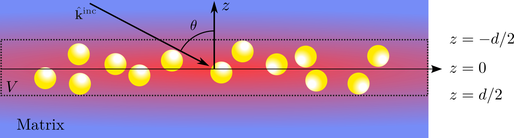
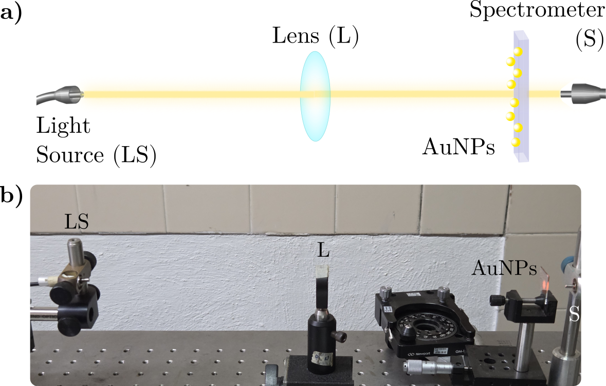
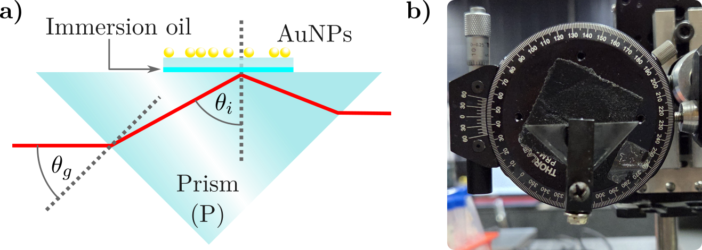

## Final figures

In this MD file the description of each figure in the PhD Protol is described as well as the location of each of their calculations (if needded) is given.

---
In the [Diagrams directory](Diagrams) the schematic representations of the CSM and the TFT can be  found. There are no calculations and the only SVG contains both diragrams. In the [Setup directory](Setups) there are contain the schematics and real pictures of the experimental setups.

| Figure | Description | Image |
|--------|-------------|-------|
| 1.1    | CSM - Free standing monolayer  | |
| 1.2    | TFT - Fresnel configuration    | |
| 1.3    | Extinction Setup               | |
| 1.4    | Reflectivity Setup             | |
| 1.5    | Goniometer and incidence angle | |

---

