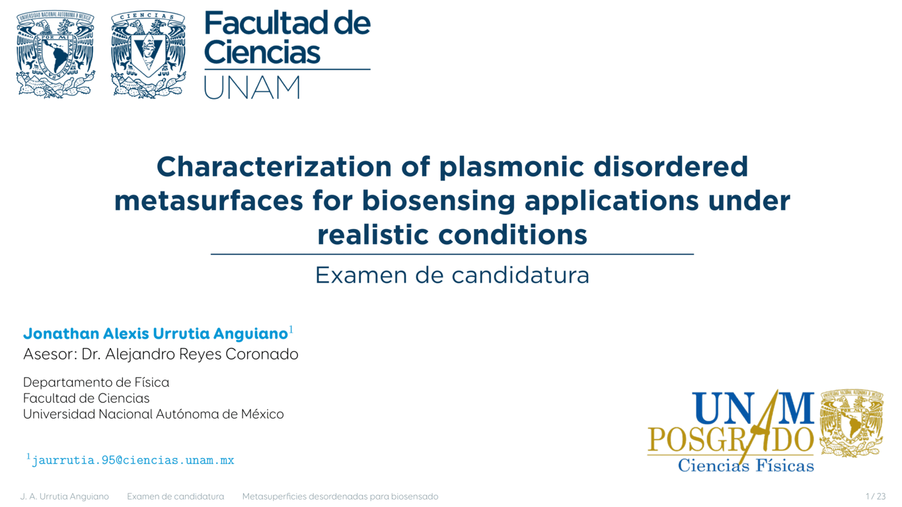

## PhD Research Protocol
### Characterization of Plasmonic Disordered Metasurfaces for Biosensing Applications under Realistic Conditions

- **Author:** Jonathan Alexis Urrutia Anguiano  
- **Advisor:** Dr. Alejandro Reyes Coronado  
- **Institution:** Facultad de Ciencias, UNAM  
- **Location & Date:** Mexico City, June 2025  

This repository contains the working materials for the **PhD research protocol** submitted in partial fulfillment of the requirements to obtain the **Candidacy to the Degree of Doctor in Sciences (Physics)** at the **Faculty of Sciences, UNAM**.

The project focuses on the **theoretical and numerical characterization of plasmonic disordered metasurfaces**, with emphasis on their performance as **optical biosensors under realistic experimental conditions**.



---

## 🧠 Research Context

Plasmonic metasurfaces exhibit strong light–matter interactions that make them promising platforms for **label-free biosensing**. However, most theoretical models assume idealized periodic structures and controlled environments.

This research addresses **realistic conditions**, including:
- Structural **disorder and size distributions**
- **Multiple scattering effects**
- Substrate and environmental influences
- Experimental limitations in optical measurements

The work builds on **scattering theories formalisms** to bridge the gap between ideal models and experimentally measurable signals.

---

## 🎯 Research Objectives

### General Objective
To characterize plasmonic disordered metasurfaces for biosensing applications using realistic theoretical and numerical models that account for disorder and experimental conditions.

### Specific Objectives
1. Implement **Coherent Scattering Models (CSM)** and **Thin Film Theory (TFT)**  forlmalisms considering particle size distributions.
2. Develop numerical tools for **optical response calculations** of disordered plasmonic systems.
3. Implement **parameter-fitting strategies** to compare theoretical predictions with experimental data.
4. Evaluate different **measurement schemes** and sensing metrics relevant to biosensing applications.

---

## 📁 Repository Structure

```text
├── 0-TeX-files-Protocolo/    # Main LaTeX source of the protocol
├── 1-Carta-Jurado/           # Committee-related documents
├── 2-Calculos-Subtrate/      # Substrate optical calculations
├── 3-Calculos-Phase/         # Phase and scattering calculations
├── 4-Presentacion/           # Defense / presentation slides
├── Figuras/                  # Figures used in the manuscript
├── PPT-Summary/              # Summary presentations
├── References.md             # Bibliographic references
├── README.md                 # Project overview (this file)
